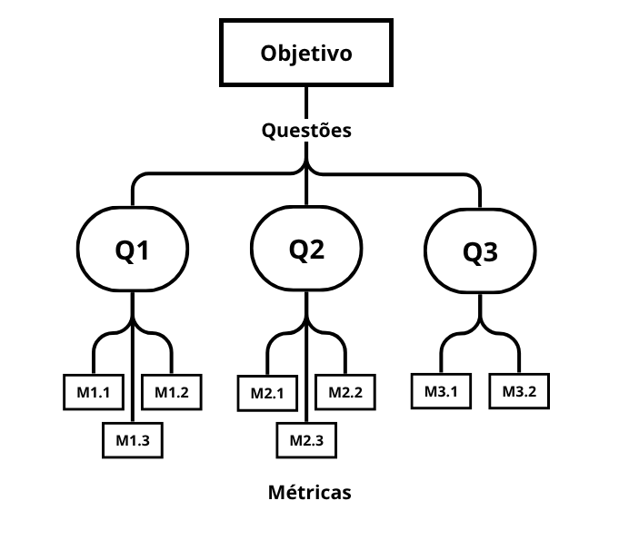

# Fase 2 - Especificar a Avaliação

## 1. Objetivo de negócio do Agromart

Facilitar o escoamento da produção da agricultura familiar por meio de uma solução tecnológica que conecta agricultores e consumidores, promovendo sustentabilidade e segurança alimentar.

## 2. Objetivo de Medição

| **🔍 Analisar**          | o Agromart                                |
|--------------------------|-------------------------------------------|
| **🎯 Para o propósito de** | entender                                |
| **📍 Com respeito a**     | usabilidade do aplicativo                |
| **💡 Do ponto de vista da** | equipe de desenvolvimento              |
| **🏫 No contexto de**     | disciplina Qualidade de Software         |

## 3. Questões Objetivo de Medição

**Q1:** O design da interface do Agromart está alinhado aos princípios de usabilidade definidos pelas heurísticas de Nielsen?

**Hipótese Q1:** A interface do Agromart está sendo construída com foco em simplicidade, acessibilidade e navegação intuitiva.

**Métricas para Q1:**

- **M1.1:** Número de inconsistências de usabilidade identificadas nas análises.
- **M1.2:** Número de heurísticas de Nielsen cobertas pelas recomendações de melhoria.
- **M1.3:** Porcentagem de sugestões de melhoria aplicadas em relação ao total identificado.

---

**Q2:** As funcionalidades do Agromart são intuitivas para os fluxos de operação definidos?

**Hipótese Q2:** Os principais fluxos são compreensíveis sem a necessidade de treinamento intensivo.

**Métricas para Q2:**

- **M2.1:** Tempo médio para completar os fluxos principais durante testes de usabilidade internos.
- **M2.2:** Quantidade de passos necessários para realizar operações críticas.
- **M2.3:** Número de dúvidas levantadas pela equipe durante as fases de testes.

---

**Q3:** O desenvolvimento do Agromart está garantindo a acessibilidade da interface para diferentes perfis de usuários?

**Hipótese Q3:** O design e os componentes da aplicação estão sendo desenvolvidos levando em consideração diferentes perfis de usuários (como agricultores e consumidores com variados níveis de familiaridade com tecnologia).

**Métricas para Q3:**

- **M3.1:** Número de elementos textuais identificados como barreira de linguagem ou vocabulário técnico inadequado.
- **M3.2:** Quantidade de ajustes realizados com base em recomendações relacionadas à clareza visual e semântica dos elementos.

## 4. Relação entre objetivos de medição – Questões e Métricas

## 5. Abstraction sheets

| **👁️ Objeto** | **🚀 Propósito** | **📍 Foco de Qualidade** | **💡 Ponto de Vista** |
|---------------|-----------------|-------------------------|----------------------|
| Agromart      | Entender  | Usabilidade | Equipe de desenvolvimento |

| 🎯 **Foco de Qualidade** | 🧩 **Fatores de Variação** |
|------------------------|---------------------------|
| ● A interface está alinhada a princípios de usabilidade (simplicidade, acessibilidade, navegação intuitiva). ● Os fluxos operacionais são intuitivos e não exigem treinamento intensivo. ● A interface é acessível para diferentes perfis de usuários (agricultores e consumidores). | ● Nível de experiência dos usuários. ● Requisitos de acessibilidade. ● Frequência de revisões de usabilidade. ● Clareza da documentação técnica. |

| **Métricas** | 📋 **Hipóteses Base (Estimativas)** | ✅ **Impacto dos Fatores de Variação** |
|------------------------------------|-----------|--------------------------------------------|
M1.1: Número de inconsistências de usabilidade identificadas nas análises.	| Aproximadamente 12 inconsistências por versão analisada.| Se os requisitos de acessibilidade não forem bem definidos, a equipe pode não identificar falhas relevantes.|
M1.2: Número de heurísticas de Nielsen cobertas pelas recomendações de melhoria. | 9 heurísticas. | Revisões mais frequentes tendem a identificar problemas variados, cobrindo mais heurísticas. |
M1.3: Porcentagem de sugestões de melhoria aplicadas em relação ao total identificado. | 80% das melhorias aplicadas. | A frequência de revisões impacta a velocidade de aplicação das melhorias.| 
M2.1: Tempo médio para completar os fluxos principais durante testes de usabilidade internos. |	2 a 3 minutos por fluxo.| Usuários menos experientes com tecnologia tendem a levar mais tempo para entender os elementos da interface, interpretar ícones ou descobrir o que é clicável, o que pode aumentar o tempo médio.|
M2.2: Quantidade de passos necessários para realizar operações críticas. |	Até 5 passos por fluxo principal.| Usuários menos experientes podem se perder em fluxos longos ou mal organizados.|
M2.3: Número de dúvidas levantadas pela equipe durante as fases de testes. | Aproximadamente 5 dúvidas por versão analisada.| Se a documentação for confusa, surgem mais dúvidas na equipe.|
M3.1: Número de elementos textuais identificados como barreira de linguagem ou vocabulário técnico inadequado. | 4 a 6 ocorrências por versão. |  A ausência de requisitos claros pode reduzir a detecção e correção de barreiras.|
M3.2: Quantidade de ajustes realizados com base em recomendações relacionadas à clareza visual e semântica dos elementos.| 8 ajustes por versão analisada. | Mais revisões resultam em mais oportunidades de corrigir falhas de clareza ou acessibilidade.|

## Tabela de contribuições

| Matrícula       | Nome Completo                          | Contribuição (%) |
|-----------------|----------------------------------------|------------------|
| 222006534       | Anna Clara Cardoso Evangelista Brandão |       18.0       |
| 231011220       | Davi Camilo Menezes                    |       10.0       |
| 221022050       | Larissa de Jesus Vieira                |       18.0       |
| 221008356       | Maria Eduarda Vieira Monteiro          |       18.0       |
| 221022417       | Paulo Henrique Melo de Souza           |       18.0       |
| 221031238       | Victor Augusto de Sousa Câmara         |       18.0       |
