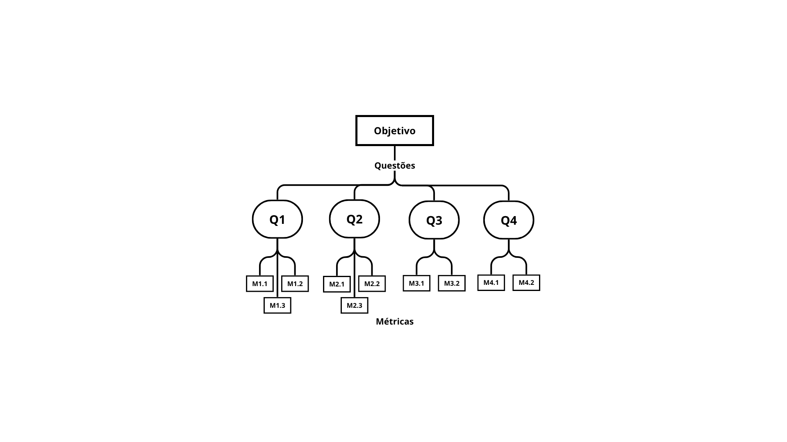

# Fase Definição

## Objetivo de negócio do Agromart

## Objetivo de Medição 1

### Questões Objetivo de Medição 1

### Relação entre objetivos de medição – Questões e Métricas

### Abstraction sheets

| **👁️ Objeto** | **🚀 Propósito** | **📍 Foco de Qualidade** | **💡 Ponto de Vista** |
|---------------|-----------------|-------------------------|----------------------|
| Agromart      | Entender o contexto da aplicação | Usabilidade | Equipe de desenvolvimento |

| 🎯 **Foco de Qualidade** | 🧩 **Fatores de Variação** |
|------------------------|---------------------------|
| ● A interface está alinhada a princípios de usabilidade (simplicidade, acessibilidade, navegação intuitiva). ● Os fluxos operacionais são intuitivos e não exigem treinamento intensivo. ● A interface é acessível para diferentes perfis de usuários (agricultores e consumidores). ● A documentação técnica é clara e suficiente para guiar o desenvolvimento. | ● Nível de experiência dos usuários. ● Requisitos de acessibilidade. ● Frequência de revisões de usabilidade. ● Clareza da documentação técnica. |

| 📋 **Hipóteses Base (estimativas)** | ✅ **Impacto dos Fatores de Variação** |
|------------------------------------|--------------------------------------|
| ● Interface com foco em simplicidade, acessibilidade e navegação intuitiva. (**Q1**) ● Os fluxos principais são compreensíveis sem necessidade de treinamento intensivo. (**Q2**) ● O design considera diferentes perfis de usuários (agricultores, consumidores com baixa familiaridade tecnológica). (**Q3**) ● Documentação clara e suficiente (**Q4**). | ● Usuários com menor familiaridade digital podem ter mais dificuldades com a navegação. ● A falta de requisitos de acessibilidade pode comprometer a experiência de usuários com deficiências. ● Revisões frequentes aumentam a consistência e a qualidade da usabilidade. ● Documentação mal elaborada pode gerar dúvidas e inconsistências no desenvolvimento. |

## Tabela de contribuições

| Matrícula       | Nome Completo                          | Contribuição (%) |
|-----------------|----------------------------------------|------------------|
| 222006534       | Anna Clara Cardoso Evangelista Brandão |              |
| 231011220       | Davi Camilo Menezes                    |              |
| 221022050       | Larissa de Jesus Vieira                |              |
| 221008356       | Maria Eduarda Vieira Monteiro          |               |
| 221022417       | Paulo Henrique Melo de Souza           |               |
| 221031238       | Victor Augusto de Sousa Câmara         |               |
